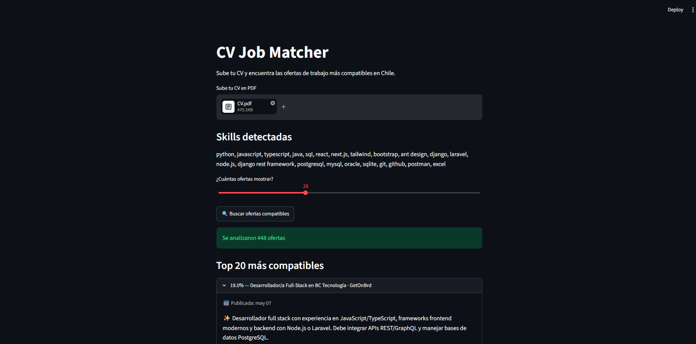

#  CV Job Matcher



Aplicación que analiza tu CV y lo compara automáticamente contra cientos de ofertas de empleo reales en Chile, mostrando un ranking de compatibilidad. Incluye además un bot que puede correr en segundo plano y notificar por Discord cuando aparecen ofertas nuevas y relevantes.

## ¿Qué hace?

1. Extrae el texto y las tecnologías mencionadas en un CV en PDF.
2. Recolecta ofertas de empleo activas desde múltiples fuentes chilenas.
3. Calcula un puntaje de compatibilidad entre el CV y cada oferta usando procesamiento de lenguaje natural (TF-IDF + similitud coseno).
4. Muestra el ranking en una interfaz web interactiva.
5. (Opcional) Notifica por Discord las ofertas nuevas que superan un umbral de compatibilidad, sin repetir avisos ya enviados.

## Fuentes de datos

| Fuente | Método |
|---|---|
| [ChileTrabajos](https://www.chiletrabajos.cl) | Feed RSS oficial |
| [GetOnBrd](https://www.getonbrd.com) | Scraping (HTML público) |
| [BNE](https://www.bne.gob.cl) | Scraping con navegador headless (Playwright) |

Todas las fuentes fueron seleccionadas verificando previamente sus políticas de `robots.txt` y términos de servicio. Se descartaron fuentes que prohíben explícitamente el acceso automatizado (ej. Computrabajo) o que requieren evadir protecciones anti-bot activas (ej. Laborum, protegido por Cloudflare).

## Stack técnico

- **Python 3.14**
- **Streamlit** — interfaz web
- **pdfplumber** — extracción de texto desde PDF
- **BeautifulSoup4 + Requests** — scraping HTML
- **Playwright** — scraping de sitios con contenido dinámico (JavaScript)
- **feedparser** — lectura de feeds RSS
- **scikit-learn** — vectorización TF-IDF y cálculo de similitud
- **SQLite** — persistencia de ofertas ya notificadas
- **Discord Webhooks** — sistema de notificaciones

## Estructura del proyecto

```text
cv-job-matcher/
├── src/
│   ├── app.py              # Interfaz web (Streamlit)
│   ├── main.py             # Orquestador del bot (modo consola/automatización)
│   ├── cv_parser.py        # Extracción de texto y skills del CV
│   ├── skills_data.py      # Diccionario de tecnologías requeridas
│   ├── matcher.py          # Cálculo de compatibilidad (TF-IDF)
│   ├── db.py               # Registro de ofertas ya notificadas (SQLite)
│   ├── notifier.py         # Envío de notificaciones a Discord
│   └── connectors/
│       ├── chiletrabajos.py
│       ├── getonbrd.py
│       └── bne.py
│
├── requirements.txt
└── README.md
```

## Instalación

```bash
git clone https://github.com/tu-usuario/cv-job-matcher.git
cd cv-job-matcher
python -m venv venv
venv\Scripts\Activate.ps1      # Windows
pip install -r requirements.txt
playwright install chromium
```

## Uso

**Interfaz web:**
```bash
streamlit run src/app.py
```

**Bot en consola (con notificaciones a Discord):**

Crea un archivo `.env` en la raíz con tu Webhook de Discord:

Luego ejecuta:
```bash
python src/main.py
```

## Limitaciones conocidas

- Las fuentes están orientadas a roles de desarrollo de software; otras áreas tech (QA, Data Science, DevOps) pueden tener menor cobertura.
- El ranking no distingue nivel de seniority (junior/senior) requerido por la oferta.


## Autor

Daniel Campos Kirkman — [GitHub](https://github.com/dacamposk)
